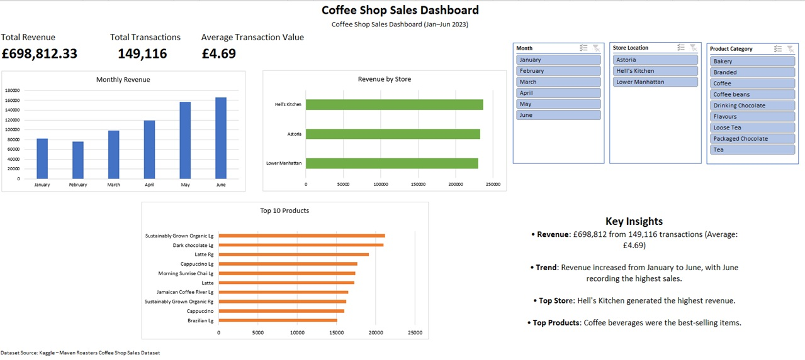

# ☕ Coffee Shop Revenue Dashboard

This is my first data analytics project using Microsoft Excel.

The project is an interactive dashboard that analyses coffee shop sales data and provides useful insights into revenue, product performance, store performance, and sales trends.

## 📊 Features

- Revenue analysis
- Monthly sales trends
- Product performance analysis
- Store performance analysis
- Hourly sales analysis
- Interactive dashboard created using Pivot Tables, Pivot Charts, and Slicers

## 🛠️ Tools Used

- Microsoft Excel
- Pivot Tables
- Pivot Charts
- Slicers

## 📁 Files

- **CoffeeShopRevenueDashboard.xlsx** – Interactive Excel dashboard

## 📷 Dashboard Preview

## 📈 Key Insights

- **Total Revenue:** £698,812.33
- **Total Transactions:** 149,116
- **Average Transaction Value:** £4.69
- **Highest Revenue Month:** June
- **Top-Performing Store:** Hell's Kitchen

Revenue increased steadily from January to June, with June recording the highest sales.

## 🎯 Skills Demonstrated

- Data cleaning
- Creating Pivot Tables
- Building Pivot Charts
- Dashboard design
- Sales data analysis
- Turning raw data into clear business insights

## 🚀 About This Project

This is my first data analytics portfolio project. It helped me improve my Microsoft Excel skills, especially in data cleaning, dashboard design, and data visualisation.

During this project, I learned how to organise raw sales data, create interactive dashboards, and present business information in a clear and easy-to-understand way. I look forward to building more data analytics projects and continuing to improve my skills.
