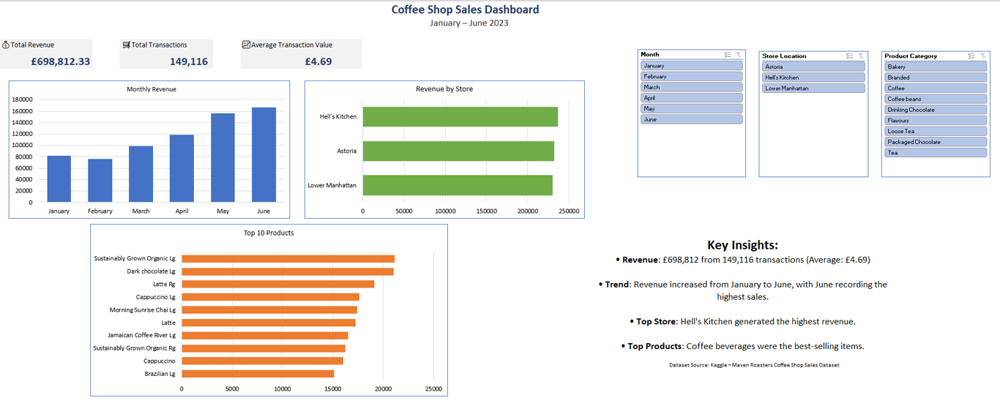

# ☕ Coffee Shop Sales Dashboard

This project is an interactive dashboard created in Microsoft Excel to analyse coffee shop sales data and present business insights in a clear and easy-to-understand way. The dashboard allows users to explore revenue, product performance, store performance, and sales trends using Pivot Tables, Pivot Charts, and Slicers.

The project involved cleaning and organising sales data, creating interactive visualisations, and analysing the data to identify trends and support business decisions.

## 🎯 Project Aim

The main goals of this project were to:

- Clean and prepare the sales data for analysis.
- Analyse sales performance using Microsoft Excel.
- Build an interactive dashboard using Pivot Tables, Pivot Charts, and Slicers.
- Identify trends in revenue, products, stores, and sales by hour.
- Present the results in a clear and easy-to-understand format.

## 📂 Dataset

The dataset contains **149,456 coffee shop transactions** collected over six months. Each record includes information about the transaction date and time, store location, products sold, quantity purchased, unit price, and revenue.

The data was cleaned and prepared in Microsoft Excel before being analysed to create the interactive dashboard.

The main columns include:

| Column | Description |
|---------|-------------|
| `transaction_id` | Unique ID for each transaction |
| `transaction_date` | Date of the transaction |
| `transaction_time` | Time of the transaction |
| `transaction_qty` | Quantity of items purchased |
| `store_id` | Store identification number |
| `store_location` | Store location |
| `product_id` | Product identification number |
| `unit_price` | Price per item |
| `product_category` | Product category |
| `product_type` | Product type |
| `product_detail` | Product description |
| `Revenue` | Total revenue from the transaction |
| `Month` | Transaction month |
| `Month No` | Month number |
| `Day` | Day of the week |
| `Hour` | Hour of the transaction |
| `Weekend` | Indicates whether the transaction occurred on a weekend |

## 📊 Features

- Revenue analysis
- Monthly sales trends
- Product performance analysis
- Store performance analysis
- Hourly sales analysis
- Interactive dashboard with Pivot Tables, Pivot Charts, and Slicers

## 🛠️ Tools Used

- Microsoft Excel
- Pivot Tables
- Pivot Charts
- Slicers

## 📁 Files

- [Coffee Dashboard.xlsx](dashboard/coffee_dashboard.xlsx) – Interactive Excel dashboard

## 📷 Dashboard Preview

The dashboard allows users to interact with the data using slicers to explore sales trends by month, store, and product category.

## ❓ Business Questions Answered

This dashboard helps answer questions such as:

- Which month generated the highest revenue?
- Which store performed best?
- Which products generated the most sales?
- At what time of day are sales highest?
- What is the average transaction value?

## 📈 Key Insights

- **Total Revenue:** £698,812.33
- **Total Transactions:** 149,116
- **Average Transaction Value:** £4.69
- **Highest Revenue Month:** June
- **Top-Performing Store:** Hell's Kitchen

The analysis showed that revenue increased steadily from January to June, with June recording the highest sales. Hell's Kitchen was the best-performing store, and the average transaction value was £4.69.

## ⚠️ Challenges Faced

During this project, I faced a few challenges that helped me improve my Excel and data analysis skills.

- Learning how to use Pivot Tables and Pivot Charts, as I had little experience with them before this project.
- Connecting multiple Pivot Tables to the same Slicers so that all charts updated correctly.
- Choosing the most important KPIs and charts without making the dashboard look crowded.
- Turning raw sales data into meaningful business insights instead of only presenting numbers.

By overcoming these challenges, I improved my Excel skills, gained confidence in creating interactive dashboards, and learned how to present data in a clear and useful way.

## 🎯 Skills Demonstrated

- Data cleaning
- Creating Pivot Tables
- Building Pivot Charts
- Dashboard design
- Sales data analysis
- Data visualisation
- Turning raw data into clear business insights

## 🚀 About This Project

This is my first data analytics portfolio project. It helped me improve my Microsoft Excel skills, especially in data cleaning, dashboard design, and data visualisation.

During this project, I learned how to organise raw sales data, create interactive dashboards, and present business information in a clear and easy-to-understand way. I look forward to building more data analytics projects, learning new tools, and continuing to improve my skills.

## 👤 Author

**Wioletta Zajac**
